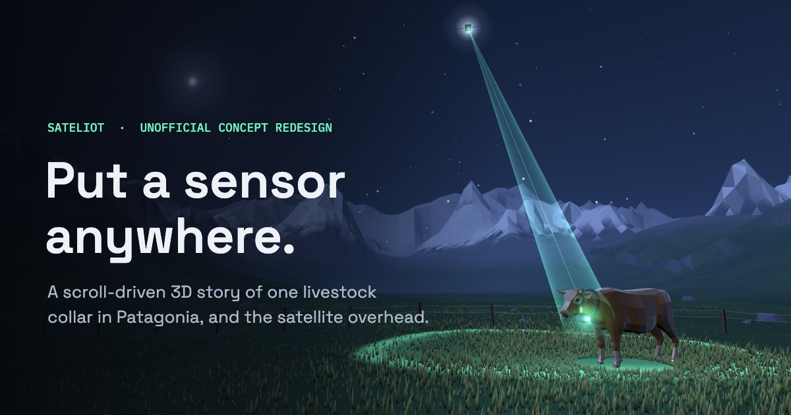

# Sateliot concept redesign (unofficial)



A scroll-driven three.js concept site that tells satellite IoT through one livestock collar in Patagonia: no signal, the coverage gap, the same chip, a satellite pass, store and forward, and the constellation growing. It is not affiliated with or endorsed by Sateliot.

- **Live site:** https://jeroginaca.github.io/sateliot-concept/
- **Case study:** https://jeroginaca.github.io/sateliot-concept/case/

```
npm install
npm run dev      # http://localhost:5188 via .claude/launch.json, or vite's default port
npm run build
```

Pushing to `main` builds and deploys to GitHub Pages (`.github/workflows/deploy.yml`).

## Where things live

- **Numbers**: all company facts are in `src/config.js` → `CONFIG.facts`. The illustrative orbital-model assumptions are in `CONFIG.model`.
- **Copy (EN/ES)**: `src/i18n.js`.
- **Chapters**: `src/main.js` (`chapters`, `hudSpecs`). `state.passTime` drives the pass scene. The scene handoffs (hero → globe, globe → collar, collar → valley) are `renderTransition`, `renderDive` and `renderLand`.
- **Scenes**: `src/scenes/valley.js` (hero, pass, closing), `globe.js` (coverage, relay, constellation, scale), `collar.js` (exploded view).
- **Model**: `src/orbit.js` computes pass windows and delivery estimates for the constellation slider and the estimator.
- **Case study**: `public/case/index.html` with stills in `public/case/`. The share image is `public/og.jpg`.

## Performance

Low-end devices (narrow screens, ≤4 cores or ≤4 GB memory) get fewer grass blades, no collar shadows and no multisampled handoffs. On every device an adaptive governor in `src/main.js` lowers render resolution when frames run slower than about 40 fps and restores it when there is headroom. All scenes are drawn once during the loader so shader compiles never land mid-transition.

## Credits

- **Cow**: "Cow" from Quaternius's Animated Animal Pack (CC0). The original is `assets/source/Cow.glb`; run `node scripts/optimize-cow.mjs` to regenerate `public/models/cow.glb` (it keeps only the Eating, Idle and Idle_Headlow clips). If the file fails to load, the scene falls back to a simple block cow.
- **Land outlines**: Natural Earth via `world-atlas`.
